## Health is wealth
Welcome to **Health is Wealth**, a vibrant fitness community dedicated to encouraging everyone to work out and improve their overall well-being! 🏋️‍♂️

We believe that fitness knows no age limit; our space is inclusive and welcoming to all individuals, regardless of how young or old you are. Here, we focus on both physical and mental strength, creating an environment that many consider their happy place.

At Health is Wealth, we combine effective workouts with fun, making our gym sessions truly exceptional. Our members often recommend us to their friends and family because we prioritize everyone’s fitness journey. Whatever session you choose, you’ll be on the path to achieving the best results! Let's work out together and enjoy the journey to better health!

# welcome to <a href="https://ein-1.github.io/health-is-wealth/  https://ein-1.github.io/Health-Is-Wealth/" target="_blank" rel="noopener">Health is wealth</a>

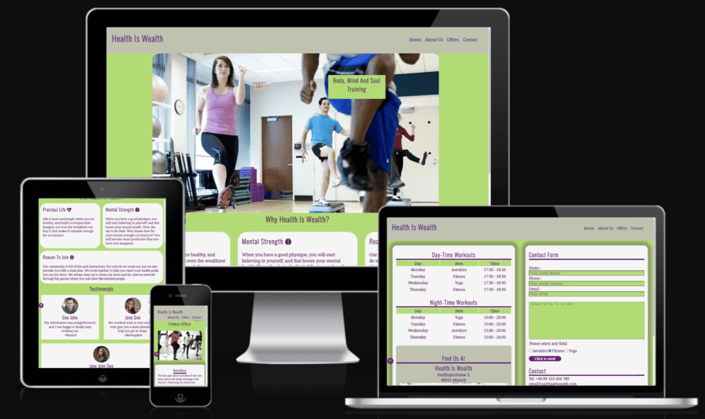
This website was designed and responds to all network devices to enhance flexibily to users.

# [Table of Contents](#table-of-contents)
* [**User Experience (UX)**](<#user-experience-ux>)
    * [**User Stories**](<#user-stories>)
    * [**Wireframes**](<#wireframes>)
    * [**Site Structure**](<#site-structure>)
    * [**Design Choices**](<#design-choices>)
        * [**Typography**](<#typography>)
        * [**Colour Scheme**](<#colour-scheme>)
* [**Features**](<#features>)
    * [**Home**](<#navigation-bar>)
         * [Navigation Bar](<#navigation-bar>)
         * [Reasons ](<#reasons >)
         * [Testimonials](<#testimonials>)
         * [Footer](<#footer>)
    * [**About Us**](<#about-us>)
        * About us
        * Our Community
    * [**Offers**](<#offers>)
        * Aerobics
        * Fitness
        * Yoga
    * [**Contact**](<#contact>)
        * Timetable with location map
        * Contact form with Contact details
    * [**Confirmation page**](<#confirmation-page>)
        * Thank for reaching us
    * [**Future Features**](<#future-features>)
* [**Technologies Used**](<#technologies-used>)
* [**Testing**](<#testing>)
    * [**W3C Validation**](<#w3c-validation>)
    * [**Manual Form Testing**](<#manual-form-testing>)
    * [**Responsiveness Test**](<#responsiveness-test>)
    * [**Browser Compatibility**](<#browser-compatibility>)
    * [**Testing User Stories**](<#testing-user-stories>)
* [**Deployment**](<#deployment>)
* [**Credits**](<#credits>)
    * [**Content**](<#content>)
    * [**Tools**](<#tools>)
    * [**Languages and Frameworks**](<#languages-and-frameworks>)
    * [**Version Control and Hosting**](<#version-control-and-hosting>)
* [**Acknowledgements**](<#acknowledgements>)

# User Experience (UX)

## User Stories

* As a user, I want to navigate through the entire site smoothly.

* As a user, I want to understand the purpose of the site upon loading.

* As a user, I want to easily contact `Health is Wealth` for more information.

* As a user, I want to see the existing offers on the `Health is Wealth` website.

* As a user, I want to learn more about `Health is Wealth`.

* As a user, I want to know about other people's experiences with `Health is Wealth`.

* As a user, I want to connect with `Health is Wealth` on social media.

* As a user, I want to know what inspired the creation of `Health is Wealth`.

[Back to top](<#table-of-contents>)

## Wireframes

The wireframes for `Health is wealth` were produced in <a href="https://balsamiq.cloud/s1zt7dl/p9ow423/r18E1" target="_blank" rel="noopener">Balsamiq</a>. There are frames for a website display and a small mobile device. The final site is slightly different from the wireframes due to developments, I made an effort to maintain consistency with but the final site display.

[Back to top](<#table-of-contents>)
## Site Structure
The **Health is Wealth** website consists of four main pages:
- **Home**: The default landing page featuring our core message and community visuals.
- **Offers**: Details the various workout activities available.
- **About Us**: Provides insights into our mission, story, and community.
- **Contact**: Includes a form for inquiries and a timetable with location information.

## Design Choices

### Typography
* The fonts chosen for the "Health is Wealth" project are 'Noto Serif' for body text and 'Oswald' for headings. They fall back to serif and sans-serif respectively if unavailable.

    * 'Noto Serif' is used for the body text, providing a classic and readable design that conveys a sense of approachability and professionalism to users.

    * 'Oswald' is selected for headings to create a strong, modern contrast with the body text. Its structured sans-serif style enhances the clarity and focus of key information.

    These fonts together establish a balanced and inviting aesthetic, aligning with the welcoming ethos of our fitness community.

### Colour Scheme

The colour scheme for the **`Health is Wealth`**  project is centered around a vibrant palette that reflects energy, balance, and vitality. It includes the following colors:

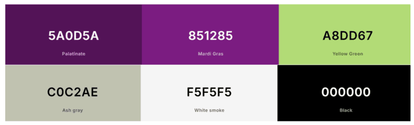
- **#5A0D5A**: A deep and rich purple, symbolizing luxury and creativity, serving as a primary accent color for key elements.
- **#A8DD67**: A fresh green hue, representing health, growth, and renewal, fitting perfectly with the workout and wellness theme.
- **#C0C2AE**: A soft neutral tone that complements other colors, offering balance and a sense of calm.
- **#851285**: A bold magenta shade, adding energy and warmth, helping to highlight important information.
- **#F5F5F5**: An off-white, clean background color that enhances readability and contrasts well with darker text.
- **#000000**: Pure black, used for text and essential elements, ensuring clarity and strong contrast.

This color palette aligns with the ethos of our community, promoting a sense of enthusiasm and inclusiveness.
Below is a color contrast testing image.

[Back to top](<#table-of-contents>)

## Features
### Navigation Bar

The Navigation bar serves as the header and is easily accessible on all pages. It includes:

- **Logo**: Located in the left corner, the logo clearly conveys the meaning of the website and serves as a link back to the homepage.

- **Linked Pages**: On the right side, you'll find links to essential pages including **Home**, **About Us**, **Offers**, and **Contact**. For improved user experience, the link to the current page is underlined, helping users easily identify their location within the site.

[Back to top](<#table-of-contents>)

### Home
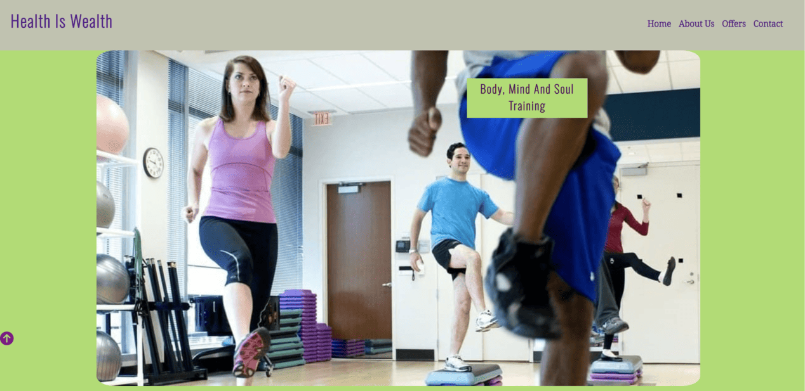

The homepage of our site prominently displays an engaging image that captures the essence of our workout sessions. This immediate visual helps users understand why our fitness community is ideal for them. Here's what you can expect:

### Reasons
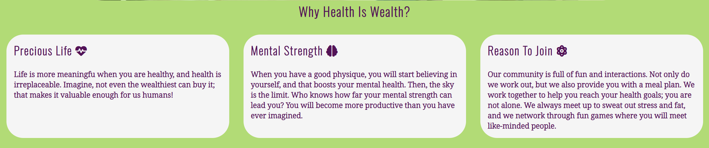
- **Reasons**: Each reason to become a part of our community is thoroughly explained, making it easy for users to understand the benefits we offer.
### Testimonials

- **Testimonials**: Statements from members who have joined our community, sharing their experiences and feedback about what makes us stand out.

[Back to top](<#table-of-contents>)

### Abour Us page
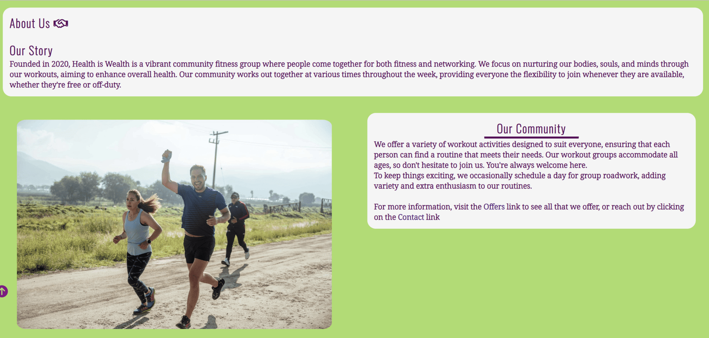

- **About Us Statement**: A concise description of who we are and what our community does helps users quickly grasp our mission. The page also features an image of a group of people engaged in road work, illustrating our active lifestyle. Additionally, users can navigate to other links for more detailed information, ensuring each page is clear and easily understandable.

[Back to top](<#table-of-contents>)

### offers page
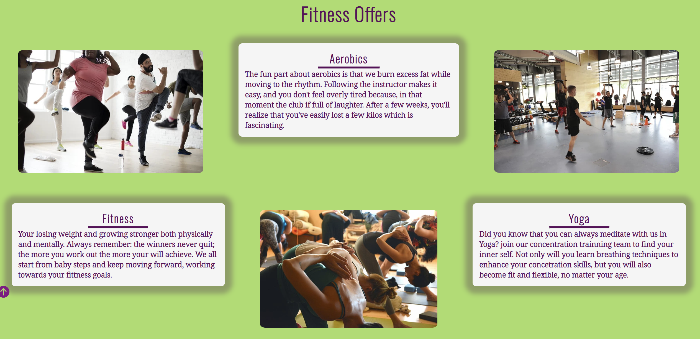

The Offer page on the `Health is Wealth` website showcases clear images of all our activities along with detailed descriptions. Users can explore and choose to join one or more of our offered activities, which are outlined below:
- **Aerobics**
- **Fitness**
- **Yoga**

[Back to top](<#table-of-contents>)

### Contact page
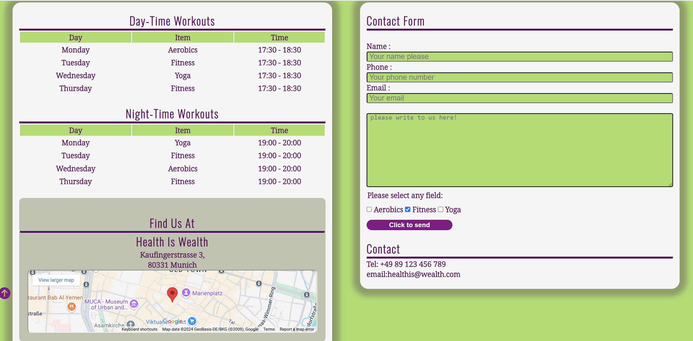

The Contact page is designed with two important features to enhance user interaction:

- **Workout Table**: This section provides a comprehensive schedule of workout days and times for the week. It also includes the location and an integrated map, enhancing the user interface by making it easy to find us.

- **Contact Form**: Easily reach out to us through this user-friendly form. It includes checkboxes for offers, a field for your contact email address, and telephone number. Once the form is correctly filled out and the send button is clicked, you will receive an instant confirmation message, verifying that your message has been sent successfully.

[Back to top](<#table-of-contents>)

### Footer

Footer is easily accessed on all pages, to enhance a good user interface we made sure that all media links change color once the curse is on then just to indicate to the user which link their about to click on. The footer includes:
* The `Adresse` of the Health is wealth. 
* The `social media links` where you can join our workout community by simply clicking on the links.
* The `Copyright` where it shows you that all rights are reserved.

[Back to top](<#table-of-contents>)

### Confirmation page
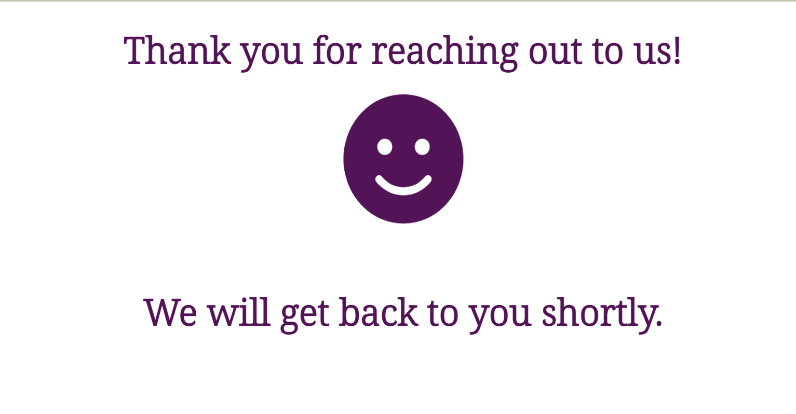

The Confirmation page indicates that your email has been successfully received, and we will get back to you shortly. This page provides reassurance and ensures that you know your message is in good hands.

[Back to top](<#table-of-contents>)

# Future Feature
# Technologies Used
## Testing
 `Health is wealth website` has be tested through the *`W3C html Validator`* and *`Jigsaw validator.`*, no errors or bugs were found in both code Validators then I used lighthouse testing too and the results were good too, below are the results.

[W3C html Validator](https://validator.w3.org/nu/?doc=https%3A%2F%2Fein-1.github.io%2Fhealth-is-wealth%2F)

[Jigsaw validator](https://jigsaw.w3.org/css-validator/validator?uri=https%3A%2F%2Fein-1.github.io%2Fhealth-is-wealth%2F&profile=css3svg&usermedium=all&warning=1&vextwarning=&lang=en)

[WAVE Web Accessibility Evaluation Tool](https://wave.webaim.org/report#/https://ein-1.github.io/health-is-wealth)
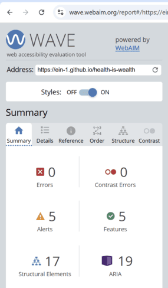

[Google Lighthouse](https://pagespeed.web.dev/analysis/https-ein-1-github-io-health-is-wealth/1iwt5z7gv0?form_factor=mobile&category=performance&category=accessibility&category=best-practices&category=seo&hl=en-GB&utm_source=lh-chrome-ext)

The site was also tested using [Google Lighthouse](https://developers.google.com/web/tools/lighthouse) in Chrome Developer Tools to test each of the pages for:
* Performance - How the page performs whilst loading.
* Accessibility - Is the site acccessible for all users and how can it be improved.
* Best Practices - Site conforms to industry best practices.
* SEO - Search engine optimisation. Is the site optimised for search engine result rankings.

[Back to top](<#table-of-contents>)

### manuel form testing

Here we minimized user's form errors before it'S submited to us,this was made to enhance user interface.

[Back to top](<#table-of-contents>)

### Responsiveness Test
The responsive design tests were carried out manually with [Google Chrome DevTools](https://developer.chrome.com/docs/devtools/) and [Responsive Design](https://ui.dev/amiresponsive?url=https://ein-1.github.io/health-is-wealth/index.html).

| Desktop    | Display > 1280px      | Display < 1280px   |
|------------|-----------------------|--------------------|
| Render     | pass                  | pass               |
| Links      | pass                  | pass               |
| Images     | pass                  | pass               |

| Tablet     | Samsung Galaxy Tab 10 | Amazon Kindle Fire | iPad Mini | iPad Pro |
|------------|-----------------------|--------------------|-----------|----------|
| Render     | pass                  | pass               | pass      | pass     |
| Links      | pass                  | pass               | pass      | pass     |
| Images     | pass                  | pass               | pass      | pass     |

| Phone      |Galaxy S5/S6/S7/S20+   | iPhone 6/7/8/ plus | iPhone 14pro max     |
|------------|-----------------------|--------------------|----------------------|
| Render     | pass                  | pass               | pass      | pass     |
| Links      | pass                  | pass               | pass      | pass     |
| Images     | pass                  | pass               | pass      | pass     |

[Back to top](<#table-of-contents>)

## Browser Compatibility
`Health Is Wealth` website was tested for functionality and appearance in the following browsers on desktop. No visible or funcional issues on all 
the browsers below.

- Google Chrome - Version 121.0.6422.114 (Official Build) (64-bit)
- Microsoft Edge - Version 124.0.2478.80 (Official build) (64-bit)
- Mozilla Firefox - 127.0 (64-bit)

[Back to top](<#table-of-contents>)

## Testing User Stories

* **As a user, I want to be able to navigate through the whole site smoothly.**
    * Navigation is located at the top of every page as part of the **Header**.
    * The **Header** includes links to all **pages**.
    * On every page, there is a **scroll-up arrow** to facilitate returning to the navigation menu.

* **As a user, I want to understand the purpose of the site upon loading it.**
    * On the home page, the logo **`Health is Wealth`** combined with the main image and the images in the **Offers** section clearly convey the primary purpose of the site.

* **As a user, I want to easily contact Health is Wealth for more information.**
    * The navigation bar features a link to the **Contact** page, where users can find contact details, a workout timetable, and a location map.
    * The **Contact** page also includes a **form** that allows users to easily email us.

* **As a user, I want to see existing offers on the `Health is Wealth` website.**
    * The home page navigation bar contains a link to the **Offers** section.
    * The **Offers** page showcases images of every available package along with a brief description of each offer.

* **As a user, I want to know what inspired `Health is Wealth`.**
    * The **About Us** page offers insights into our origins and the inspiration behind our community, helping users understand how we began and what they can potentially achieve.
    * This page also provides straightforward descriptions of how to join our workout groups.

* **As a user, I want to know how other people's experiences with `Health is Wealth` have been.**
    * At the bottom of the home page, there are several **testimonials** from previous customers.

* **As a user, I want to connect with `Health is Wealth` on social media.**
    * In the **footer** of every page, there are **social media links** to `Health is Wealth` social media pages.

[Back to top](<#table-of-contents>)

## Deployment
### **To deploy the project**
The site was deployed to GitHub pages. The steps to deploy a site are as follows:
  1. In the GitHub repository, navigate to the **Settings** tab.
  2. Once in Settings, navigate to the **Pages** tab on the left hand side.
  3. Under **Source**, select the branch to **main**, then click **save**.
  4. Once the main branch has been selected, the page will be automatically refreshed with a display to indicate the successful deployment.

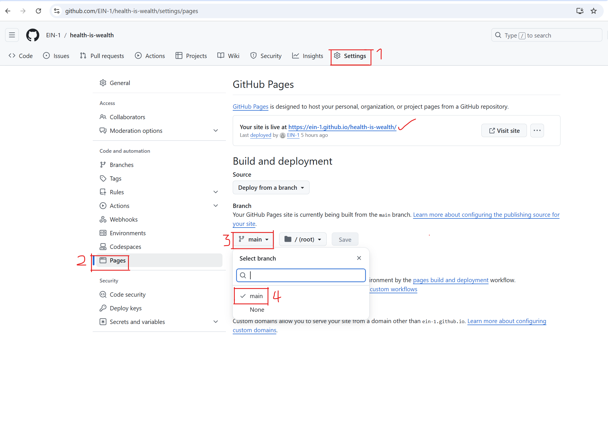

  The live link to the Github repository can be found here -  https://ein-1.github.io/health-is-wealth/
## Fork
### How To Fork The Repository On GitHub
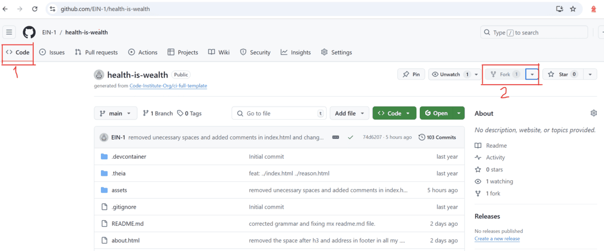
It is possible to do a copy of a GitHub Repository by forking the GitHub account. The copy can then be viewed and it is also possible to do changes in the copy without affecting the original repository. To fork the repository, take these steps:

1. After logging in to GitHub, locate the repository. On the top right side of the page there is a 'Fork' button. Click on the button to create a copy of the original repository.

[Back to top](<#table-of-content>)

## Clone
### Create A Local Clone of A Project
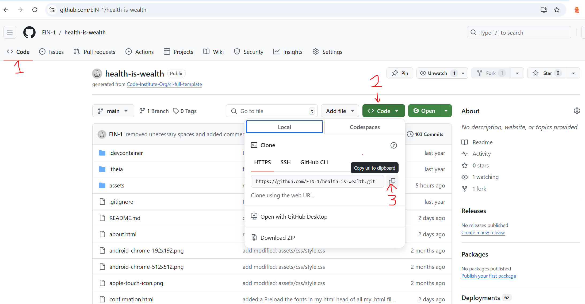
To create a local clone of your repository, follow these steps:

1. When you are in the repository, find the code tab and click it.
2. To the left of the green GitPod button, press the 'code' menu. There you will find a link to the repository. Click on the clipboard icon to copy the URL.
3. Use an IDE and open Git Bash. Change directory to the location where you want the cloned directory to be made.
4. Type 'git clone', and then paste the URL that you copied from GitHub. Press enter and a local clone will be created.

[Back to top](<#table-of-content>)

## Credits
### Content
- The fonts were sourced from [Google Fonts](https://fonts.google.com/).
- The map is embedded from [Google Maps](https://www.google.com/maps).
- Icons were provided by [Font Awesome](https://fontawesome.com/).
- The color palette was compiled by [Coolors](https://coolors.co/).
- The code for Safari-specific styling was inspired by an example on [Stack Overflow](https://stackoverflow.com/).
- The photos all came from [Pexels](https://www.pexels.com/).
- The photos were compressed using [iloveimg](https://www.iloveimg.com/).

### Tools
- [**AmIResponsive**](https://ui.dev/amiresponsive) - Used for generating the responsive preview image on different devices.
- [**Balsamiq**](https://balsamiq.com/wireframes/) - Utilized to create the wireframe design for the website.
- [**FavIcon.io**](https://favicon.io/favicon-generator/) - Used to generate the favicon.
- [**iloveimg**](https://www.iloveimg.com/) - Utilized for compressing images to optimize performance.
- [**Gitpod**](https://gitpod.com/) - Online IDE used for developing the project.
- [**Wave by WebAIM**](https://wave.webaim.org/) - Checked for errors and color contrast to ensure accessibility.
- [**Coolors**](https://coolors.co/contrast-checker/) - Used to create and check color palettes.

### Languages and Frameworks
- [**CSS**](https://developer.mozilla.org/en-US/docs/Web/CSS) - Employed for styling the project.
- [**HTML**](https://developer.mozilla.org/en-US/docs/Web/HTML) - Used as the template language for the FrontEnd of the project.
- [**Python**](https://www.python.org/) - The main BackEnd programming language employed in this project.

### Version Control and Hosting
- [**Git**](https://git-scm.com/doc) - Managed source code changes with commits and pushed updates to GitHub.
- [**GitHub**](https://github.com/) - Served as the platform for version control and project repository hosting.

[Back to top](<#table-of-contents>)

# Acknowledgements
The site was created as part of the **Portfolio 1 Project** for the **Full Stack Software Developer** program at the [Code Institute](https://codeinstitute.net/). 🎉 

I would like to extend my heartfelt gratitude to my mentor, [Precious Ijege](https://www.linkedin.com/in/precious-ijege-908a00168/), and the incredible **Slack community**, along with everyone at the Code Institute for their invaluable help and support throughout this journey.

**Health is Wealth** is an inspiring workout group concept that I developed, focusing on building a supportive community where individuals can achieve their fitness goals together! 💪🌟

Elsie Nagawa 2024.

[Back to top](<#table-of-contents>)

