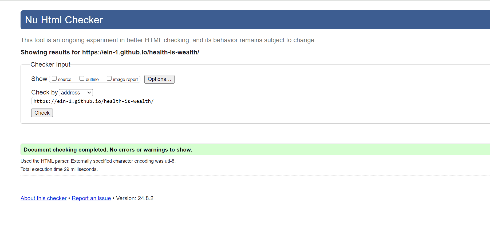

## Health is wealth
This is a fitness gym which encourages all people to work-out to improve your all being, it doesn't mater how old you are, this is a space free zone for all ages, it focuses on both physical and mental strength and to many it is a happy place, we like working out while having fun at the sometime and our gym sessions are next to none, those who have joined us keep on recomanding others we make sure that we are all in good shape, depending what session you choice you end up with the best results.

# welcome to <a href="https://ein-1.github.io/health-is-wealth/" target="_blank" rel="noopener">Health is wealth</a>

This website was designed and responds to all network devices to enhance flexibily to users.

# Index – Table of Contents
* [**User Experience (UX)**](#user-experience-ux)
    * [**User Stories**](<#user-stories>)
    * [**Wireframes**](<#wireframes>)
    * [**Site Structure**](<#site-structure>)
    * [**Design Choices**](<#design-choices>)
    *  [**Typography**](<#typography>)
    *  [**Colour Scheme**](<#colour-scheme>)
* [**Features**](<#features>)
    * [**Home**](<#navigation-menu>)
         * [Navigation menu](<#navigation-menu>)
         * [Reasons ](<#reasons >)
         * [About](<#about>)
         * [Testimonials](<#testimonials>)
         * [Footer](<#footer>)
    * [**Offers**](<#offers>)
        * Aerobics
        * Fitness
        * Yoga
    * [**Contact**](<#contact>)
        * Timetable with location map
        * Contact form with Contact details
    * [**Form Confirmation**](<#form-confirmation>)
        * Thank you page
    * [**Future Features**](<#future-features>)
* [**Technologies Used**](<#technologies-used>)
* [**Testing**](<#testing>)
* [**Deployment**](<#deployment>)
* [**Credits**](<#credits>)
    * [**Content**](<#content>)
    * [**Media**](<#media>)
* [**Acknowledgements**](<#acknowledgements>)

## User Experience (UX)

### User Stories
* As a user I want to be able to navigate through the whole site smoothly.
    * Navigation is at the top of every page as my **Header**.
    * In the `Header`, there are links to all **pages**.
    * On every page there is a **scroll up arrow** to ease the route to the navigation menu.

* As a user I want to understand the purpose of the site upon loading it.
    * On the home page, the logo **`Health is Wealth`** combined with the main image and those in the **offers** allows the user to interpolate the main purpose of the site.

* As a user I want to easily be able to contact Wawas Woods for more information.
    * On the navigation bar there is a link to **contact** page, there are contact details, workout timetable and location map.
    * On the **contact** page there is also a **form** to easily e-mail us.

* As a user I want to see existing offers on `Health is Wealth` website.
    * On the home page navigation bar there is a link to **offers** section.
    * On **offers** page there are images of every offered package and a brief descripton of each offer. 

* As a user I want to know more about `Health is Wealth`.
    * On the home page there is the **About** section. This gives a brief description on how `Health is Wealth` is.

* As a user I want to know how other peoples' experiences with `Health is Wealth` have been.
    * At the bottom of the home page there are some **testimonials** from previous customers.

* As a user I want to connect with `Health is Wealth` on social media.
    * In the **footer** of every page there are some **social media links** to `Health is Wealth` social media pages.

* As a user I want to know what inspired `Health is Wealth`.
    * One of the pages is an **inspiration** page. It is designed to give the user an idea of how projects start out and what they could potentially become.
    * On the **inspiration** page there are also simplistic descriptions for how to join the workout groups.

[Back to top](<#table-of-contents>)

# Features

## Design

The wireframes for `Health is wealth` were produced in <a href="https://balsamiq.cloud/s1zt7dl/p9ow423/r18E1" target="_blank" rel="noopener">Balsamiq</a>. There are frames for a website display and a small mobile device. The final site is slightly different from the wireframes due to developments but I tired to keep in as the final site display.

## Navigation Bar

Navigation bar is my `header` which is easily accessed on all pages and it includes:
* The `Logo` in the left corner which states the clear meaning of the page. 
* The `linked pages` on the right includes the `home, offer and contact` and for user interface every current page the user is on, it's link is underlined.

[Back to top](<#table-of-contents>)

## Home page

Home page shows clearly the Image of what happens in workout sessions so the user can clearly knows once the page is uploaded it clearly shows the user why this page is suitable for them by stating: 
* The `reasons` to join us and every reason is clarily explained for the user to unserstand. 
* Simple `About us` statment to help the user understand more about what we do and the user can simply go to other `links` for more clarity given that every page is visibily understandable.

[Back to top](<#table-of-contents>)

## offers page

Offer page shows clear images of all offer's activities and it's decriptions at `Health is wealth` website. The user can join one or more offers and they are edicated below:
* Aerobics 
* Fitness
* Yoga

[Back to top](<#table-of-contents>)

## Contact page

Contact page has two important items and they are indicated below:
* Workout table this includes the days and workout time of a week, and it shows the location and it's map to enhance user interface.
* Contact form this helps to easily email us and ask us anything, it includes offer's checkboxs, conatct email adress and telephone number and once the form is correctly filled, you can easily clike the send button then you will receive an instant `confirmation message` that proves that your message has been sent.

[Back to top](<#table-of-contents>)

## Footer

Footer is easily accessed on all pages, to enhance a good user interface we made sure that all media links change color once the curse is on then just to indicate to the user which link their about to click on. The footer includes:
* The `Adresse` of the Health is wealth. 
* The `social media links` where you can join our workout community by simply clicking on the links.
* The `Copyright` where it shows you that all rights are reserved.

[Back to top](<#table-of-contents>)

## Confirmation page

Confirmation page indicates that your email has been received and we will get back to you shortly, it also include a `Home link` to enhance a good user interface although there are links in the navigation bar which is the header.

[Back to top](<#table-of-contents>)

# Future Features
* 

# Design Choices
* Typography

# Technologies Used
## Testing
 `Health is wealth website` has be tested through the *`W3C html Validator`* and *`Jigsaw validator.`*, no errors or bugs were found in both code Validators then I used lighthouse testing too and the results were good too, below are the results.

[W3C html Validator](https://validator.w3.org/nu/?doc=https%3A%2F%2Fein-1.github.io%2Fhealth-is-wealth%2F)

[Jigsaw validator](https://jigsaw.w3.org/css-validator/validator?uri=https%3A%2F%2Fein-1.github.io%2Fhealth-is-wealth%2F&profile=css3svg&usermedium=all&warning=1&vextwarning=&lang=en)

[Google Lighthouse](https://pagespeed.web.dev/analysis/https-ein-1-github-io-health-is-wealth/1iwt5z7gv0?form_factor=mobile&category=performance&category=accessibility&category=best-practices&category=seo&hl=en-GB&utm_source=lh-chrome-ext)

The site was also tested using [Google Lighthouse](https://developers.google.com/web/tools/lighthouse) in Chrome Developer Tools to test each of the pages for:
* Performance - How the page performs whilst loading.
* Accessibility - Is the site acccessible for all users and how can it be improved.
* Best Practices - Site conforms to industry best practices.
* SEO - Search engine optimisation. Is the site optimised for search engine result rankings.
### Form error testing

Here we minimized user's form errors before it'S submited to us,this was made to enhance user interface.

[Back to top](<#table-of-contents>)

### Responsiveness Test
The responsive design tests were carried out manually with [Google Chrome DevTools](https://developer.chrome.com/docs/devtools/) and [Responsive Design](https://ui.dev/amiresponsive?url=https://ein-1.github.io/health-is-wealth/index.html).

| Desktop    | Display > 1280px      | Display < 1280px   |
|------------|-----------------------|--------------------|
| Render     | pass                  | pass               |
| Links      | pass                  | pass               |
| Images     | pass                  | pass               |

| Tablet     | Samsung Galaxy Tab 10 | Amazon Kindle Fire | iPad Mini | iPad Pro |
|------------|-----------------------|--------------------|-----------|----------|
| Render     | pass                  | pass               | pass      | pass     |
| Links      | pass                  | pass               | pass      | pass     |
| Images     | pass                  | pass               | pass      | pass     |

| Phone      |Galaxy S5/S6/S7/S20+   | iPhone 6/7/8/ plus | iPhone 14pro max     |
|------------|-----------------------|--------------------|----------------------|
| Render     | pass                  | pass               | pass      | pass     |
| Links      | pass                  | pass               | pass      | pass     |
| Images     | pass                  | pass               | pass      | pass     |

[Back to top](<#table-of-contents>)

## Browser Compatibility
`Health Is Wealth` website was tested for functionality and appearance in the following browsers on desktop. No visible or funcional issues on all 
the browsers below.

- Google Chrome - Version 121.0.6422.114 (Official Build) (64-bit)
- Microsoft Edge - Version 124.0.2478.80 (Official build) (64-bit)
- Mozilla Firefox - 127.0 (64-bit)

[Back to top](<#table-of-content>)

## Main Language
- Python Language

## Frameworks, Libraries & Programs

- [**AmIResponsive**](https://ui.dev/amiresponsive) - the responsive preview image on different gadgets.
- [**iloveimg**](https://www.iloveimg.com/) - to compress the images.
- [**Google Fonts**](https://fonts.google.com/) site was used to pick the best typography style. The most importance was given to balance between style and readability. As a developer I needed to ensure that all text is displayed clear.
- [**Balsamiq**](https://balsamiq.cloud/s1zt7dl/p9ow423/r18E1) - create wireframe design for this website.
- [**Python**](https://www.python.org/) - main BackEnd programming language of the project.
- [**HTML**](https://developer.mozilla.org/en-US/docs/Web/HTML) - templates programming language of this project (FrontEnd).
- [**CSS**](https://developer.mozilla.org/en-US/docs/Web/CSS) - styling the project.
- [**Gitpod**](https://gitpod.com/) - online IDE - gitpod was used to create this project.
- [**Git**](https://git-scm.com/doc) - to make commitments of progress and push the results back to GitHub.
- [**GitHub**](https://github.com/) - to keep the track of version control.
- [**Google Fonts**](https://fonts.google.com/) - used for picking the best typography.
- [**FavIcon.io**](https://favicon.io/favicon-generator/) - used to generate favicon.
- [**W3Schools**](https://www.w3schools.com/) - useful information and cheat sheets.

[Back to top](<#table-of-contents>)

## Deployment

## Credits
### Content

* The font came from [Google Fonts](https://fonts.google.com/).
* The map is embedded from [Google Maps](https://www.google.com/maps).
* The icons came from [Font Awesome](https://fontawesome.com/).
* [Balsamiq](https://balsamiq.com/wireframes/) was used to create the wireframes.
* The colour palate was compiled by [Coolors](https://coolors.co/).
* The code for the Safari specific styling was inspired by an example on [Stack Overflow](https://stackoverflow.com/).

### Media
* The photos all came from , [pexels](https://www.pexels.com/).
* The photos were compressed using [iloveimg](https://www.iloveimg.com/).

[Back to top](<#contents>)

# Acknowledgements
The site was created as part of the **Portfolio 1 Project** for the **Full Stack Software Developer** program at the [Code Institute](https://codeinstitute.net/). 🎉 

I would like to extend my heartfelt gratitude to my mentor, [Precious Ijege](https://www.linkedin.com/in/precious-ijege-908a00168/), and the incredible **Slack community**, along with everyone at the Code Institute for their invaluable help and support throughout this journey. 🙏

**Health is Wealth** is an inspiring workout group concept that I developed, focusing on building a supportive community where individuals can achieve their fitness goals together! 💪🌟

Elsie Nagawa 2024.

[Back to top](<#contents>)

